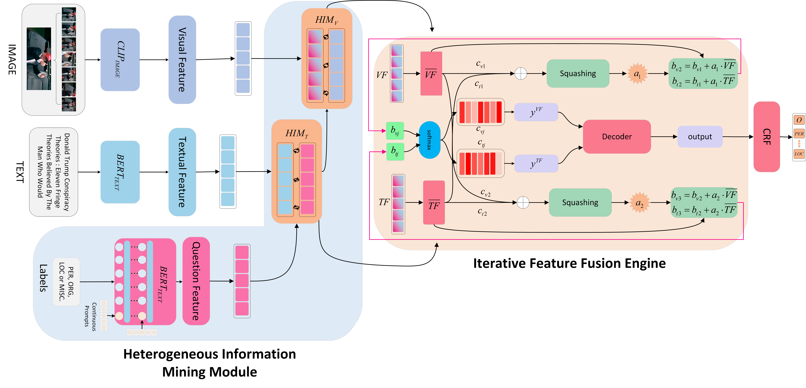

# RPI-HMIF

## Architecture




We highly suggest you using [Anaconda](https://www.anaconda.com) to manage your python environment.

## Dataset
The MNRE dataset comes from https://github.com/thecharm/Mega, many thanks.
You can download the Twitter2015 and Twitter2017 dataset with detected visual objects using folloing command:
```bash
wget 120.27.214.45/Data/ner/multimodal/data.tar.gz
tar -xzvf data.tar.gz
```
- The twitter15 dataset with detected visual objects is stored in `data`:
    
  - `twitter15_detect`：Detected objects using RCNN
  - `twitter2015_aux_images`：Detected objects using visual grouding
  - `twitter2015_images`： Original images
  - `train.txt`: Train set
  - `...`
## How to install
```
pip install -r requirements.txt
python setup.py install
```
## How to Run

### Quick start
Download the [PLM](https://huggingface.co/openai/clip-vit-base-patch32/tree/main) and set `vit_name` in `train.yaml` and `predict.yaml` as the directory of the PLM.

The script **run.py** acts as a main function to the project, you can run the experiments by replacing the unspecified options in the following command with the corresponding values:

```shell
    cd example/ner/multimodal
    CUDA_VISIBLE_DEVICES=$1 python run.py
```

or run the script **run.py** directly via pycharm.
